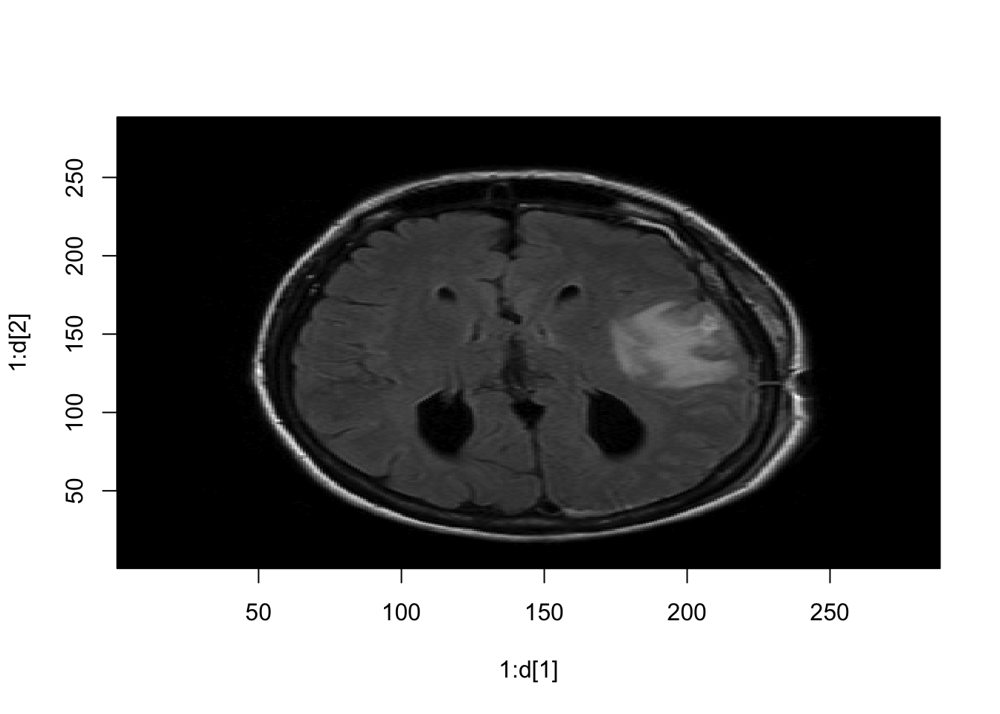

# DICOM 
DICOM (Digital Imaging and Communications in Medicine) format

- Standardized representation of images
- Formats of files from scanner to hospital PACS (picture archiving and communication system)
- Two components: image data (in pixles) and header (metadata)

## readDICOM Output

The pixel data in a DICOM file is a matrix

One DICOM file = one "slice of the brain

The `oro.dicom` package enables reading DICOM files in R. 


Each slice is stored as a list.


```r
library(oro.dicom)
```

```
## oro.dicom 0.5.3
```

```r
slice = readDICOM("Neurohacking_data/BRAINIX/DICOM/FLAIR/IM-0001-0011.dcm")
suppressMessages(class(slice))
```

```
## [1] "list"
```

This contains two lists: `hdr` and `img`


```r
names(slice)
```

```
## [1] "hdr" "img"
```

```r
class(slice$hdr)
```

```
## [1] "list"
```

```r
class(slice$img)
```

```
## [1] "list"
```

Each element of `hdr` is a data.frame and each element of `img`  is a matrix


```r
class(slice$hdr[[1]])
```

```
## [1] "data.frame"
```

```r
class(slice$img[[1]])
```

```
## [1] "matrix"
```

```r
dim(slice$img[[1]])
```

```
## [1] 288 288
```

## DICOM Images

We can look at the image in R.


```r
d = dim(t(slice$img[[1]]))
image(1:d[1], 1:d[2], t(slice$img[[1]]), col=gray(0:64/64))
```



For analysis we want to look at the numbers in the matrix, not the image in the grayscale.

### Working with the numbers


```r
slice$img[[1]][101:105, 121:125]
```

```
##      [,1] [,2] [,3] [,4] [,5]
## [1,]    4   34   36   75  222
## [2,]    9   44   33  117  248
## [3,]   19   47   54  167  274
## [4,]   27   28   98  239  286
## [5,]   12   45  170  288  307
```

And we can plot the data as usual using histograms

```r
hist(slice$img[[1]][,], #all elements
breaks=50, xlab="FLAIR",
prob=T, col = rgb(0, 0, 1, 1/4),
main="")
```


## DICOM Header Information
Now let's look at the header.


```r
hdr = slice$hdr[[1]]
str(hdr)
```

```
## 'data.frame':	162 obs. of  7 variables:
##  $ group   : chr  "0002" "0002" "0002" "0002" ...
##  $ element : chr  "0000" "0001" "0002" "0003" ...
##  $ name    : chr  "GroupLength" "FileMetaInformationVersion" "MediaStorageSOPClassUID" "MediaStorageSOPInstanceUID" ...
##  $ code    : chr  "UL" "OB" "UI" "UI" ...
##  $ length  : chr  "4" "2" "26" "62" ...
##  $ value   : chr  "210" "\001" "1.2.840.10008.5.1.4.1.1.4" "1.3.46.670589.11.0.0.11.4.2.0.8743.5.5396.2006120114313982544" ...
##  $ sequence: chr  "" "" "" "" ...
```

Each row of the dataframe has a name:


```r
hdr$name
```

```
##   [1] "GroupLength"                             
##   [2] "FileMetaInformationVersion"              
##   [3] "MediaStorageSOPClassUID"                 
##   [4] "MediaStorageSOPInstanceUID"              
##   [5] "TransferSyntaxUID"                       
##   [6] "ImplementationClassUID"                  
##   [7] "ImplementationVersionName"               
##   [8] "SourceApplicationEntityTitle"            
##   [9] "SpecificCharacterSet"                    
##  [10] "ImageType"                               
##  [11] "InstanceCreationDate"                    
##  [12] "InstanceCreationTime"                    
##  [13] "InstanceCreatorUID"                      
##  [14] "SOPClassUID"                             
##  [15] "SOPInstanceUID"                          
##  [16] "StudyDate"                               
##  [17] "SeriesDate"                              
##  [18] "AcquisitionDate"                         
##  [19] "ContentDate"                             
##  [20] "StudyTime"                               
##  [21] "SeriesTime"                              
##  [22] "AcquisitionTime"                         
##  [23] "ContentTime"                             
##  [24] "AccessionNumber"                         
##  [25] "Modality"                                
##  [26] "Manufacturer"                            
##  [27] "InstitutionName"                         
##  [28] "ReferringPhysiciansName"                 
##  [29] "StationName"                             
##  [30] "StudyDescription"                        
##  [31] "ProcedureCodeSequence"                   
##  [32] "Item"                                    
##  [33] "CodeValue"                               
##  [34] "CodingSchemeDesignator"                  
##  [35] "CodeMeaning"                             
##  [36] "ContextGroupExtensionFlag"               
##  [37] "ItemDelimitationItem"                    
##  [38] "SequenceDelimitationItem"                
##  [39] "SeriesDescription"                       
##  [40] "InstitutionalDepartmentName"             
##  [41] "ManufacturersModelName"                  
##  [42] "ReferencedStudySequence"                 
##  [43] "Item"                                    
##  [44] "ReferencedSOPClassUID"                   
##  [45] "ReferencedSOPInstanceUID"                
##  [46] "ItemDelimitationItem"                    
##  [47] "SequenceDelimitationItem"                
##  [48] "ReferencedPerformedProcedureStepSequence"
##  [49] "Item"                                    
##  [50] "InstanceCreationDate"                    
##  [51] "InstanceCreationTime"                    
##  [52] "InstanceCreatorUID"                      
##  [53] "ReferencedSOPClassUID"                   
##  [54] "ReferencedSOPInstanceUID"                
##  [55] "InstanceNumber"                          
##  [56] "ItemDelimitationItem"                    
##  [57] "SequenceDelimitationItem"                
##  [58] "ReferencedImageSequence"                 
##  [59] "Item"                                    
##  [60] "ReferencedSOPClassUID"                   
##  [61] "ReferencedSOPInstanceUID"                
##  [62] "ItemDelimitationItem"                    
##  [63] "Item"                                    
##  [64] "ReferencedSOPClassUID"                   
##  [65] "ReferencedSOPInstanceUID"                
##  [66] "ItemDelimitationItem"                    
##  [67] "Item"                                    
##  [68] "ReferencedSOPClassUID"                   
##  [69] "ReferencedSOPInstanceUID"                
##  [70] "ItemDelimitationItem"                    
##  [71] "SequenceDelimitationItem"                
##  [72] "PatientsName"                            
##  [73] "PatientID"                               
##  [74] "PatientsBirthDate"                       
##  [75] "PatientsSex"                             
##  [76] "PatientsWeight"                          
##  [77] "PregnancyStatus"                         
##  [78] "ScanningSequence"                        
##  [79] "SequenceVariant"                         
##  [80] "SliceThickness"                          
##  [81] "RepetitionTime"                          
##  [82] "EchoTime"                                
##  [83] "InversionTime"                           
##  [84] "NumberOfAverages"                        
##  [85] "ImagingFrequency"                        
##  [86] "ImagedNucleus"                           
##  [87] "EchoNumbers"                             
##  [88] "MagneticFieldStrength"                   
##  [89] "SpacingBetweenSlices"                    
##  [90] "NumberOfPhaseEncodingSteps"              
##  [91] "EchoTraInLength"                         
##  [92] "PercentSampling"                         
##  [93] "PercentPhaseFieldOfView"                 
##  [94] "DeviceSerialNumber"                      
##  [95] "SoftwareVersions"                        
##  [96] "ProtocolName"                            
##  [97] "LowRRValue"                              
##  [98] "HighRRValue"                             
##  [99] "IntervalsAcquired"                       
## [100] "IntervalsRejected"                       
## [101] "HeartRate"                               
## [102] "ReconstructionDiameter"                  
## [103] "ReceiveCoilName"                         
## [104] "TransmitCoilName"                        
## [105] "AcquisitionMatrix"                       
## [106] "InPlanePhaseEncodingDirection"           
## [107] "FlipAngle"                               
## [108] "PatientPosition"                         
## [109] "StudyInstanceUID"                        
## [110] "SeriesInstanceUID"                       
## [111] "StudyID"                                 
## [112] "SeriesNumber"                            
## [113] "AcquisitionNumber"                       
## [114] "InstanceNumber"                          
## [115] "ImagePositionPatient"                    
## [116] "ImageOrientationPatient"                 
## [117] "FrameOfReferenceUID"                     
## [118] "TemporalPositionIdentifier"              
## [119] "NumberOfTemporalPositions"               
## [120] "SliceLocation"                           
## [121] "SamplesperPixel"                         
## [122] "PhotometricInterpretation"               
## [123] "Rows"                                    
## [124] "Columns"                                 
## [125] "PixelSpacing"                            
## [126] "PixelAspectRatio"                        
## [127] "BitsAllocated"                           
## [128] "BitsStored"                              
## [129] "HighBit"                                 
## [130] "PixelRepresentation"                     
## [131] "WindowCenter"                            
## [132] "WindowWidth"                             
## [133] "LossyImageCompression"                   
## [134] "RequestingService"                       
## [135] "RequestedProcedureDescription"           
## [136] "PerformedStationAETitle"                 
## [137] "PerformedProcedureStepStartDate"         
## [138] "PerformedProcedureStepStartTime"         
## [139] "PerformedProcedureStepEndDate"           
## [140] "PerformedProcedureStepEndTime"           
## [141] "PerformedProcedureStepID"                
## [142] "PerformedProcedureStepDescription"       
## [143] "PerformedProtocolCodeSequence"           
## [144] "Item"                                    
## [145] "CodeValue"                               
## [146] "CodingSchemeDesignator"                  
## [147] "CodeMeaning"                             
## [148] "ContextGroupExtensionFlag"               
## [149] "ItemDelimitationItem"                    
## [150] "SequenceDelimitationItem"                
## [151] "RequestAttributesSequence"               
## [152] "Item"                                    
## [153] "ScheduledProcedureStepDescription"       
## [154] "ScheduledProcedureStepID"                
## [155] "RequestedProcedureID"                    
## [156] "ItemDelimitationItem"                    
## [157] "SequenceDelimitationItem"                
## [158] "FilmConsumptionSequence"                 
## [159] "SequenceDelimitationItem"                
## [160] "RequestedProcedureID"                    
## [161] "PresentationLUTShape"                    
## [162] "PixelData"
```

Let's look at the `"PixelSpacing"` for this images, which represents the resolution of the image. 


```r
hdr[hdr$name == 'PixelSpacing', 'value']
```

```
## [1] "0.79861110448837 0.79861110448837"
```

We can also look at the Flip Angle used while collecting the image.

```r
hdr[hdr$name == 'FlipAngle', ]
```

```
##     group element      name code length value sequence
## 107  0018    1314 FlipAngle   DS      4  90.0
```

## Loading Multiple DICOM Files

For analysis, we will need to read in all the slices. Specifying a directory instead of a file name in `readDICOM` will load all images in that directory as a single object.

```r
all_slices_T1 = readDICOM("Neurohacking_data/BRAINIX/DICOM/T1/")
```

Examining the dimensions of the first slice shows that the T1 image has a higher resolution than the FLAIR image. Thus this is a bigger

```r
dim(all_slices_T1$img[[1]])
```

```
## [1] 512 512
```

```r
hdr = all_slices_T1$hdr[[1]]
hdr[hdr$name == "PixelSpacing", "value"]
```

```
## [1] "0.46875 0.46875"
```

## Summary 
-DICOM files contain a lot of information
-Image data are stored as collection of 2D slice files
-Different sequences can have different resolutions
-Data and metadata can be accessed in R
-Contains protected health data
-Structure is cumbersome for 3D analysis
-A genuine 3D format is needed:: NIfTI


