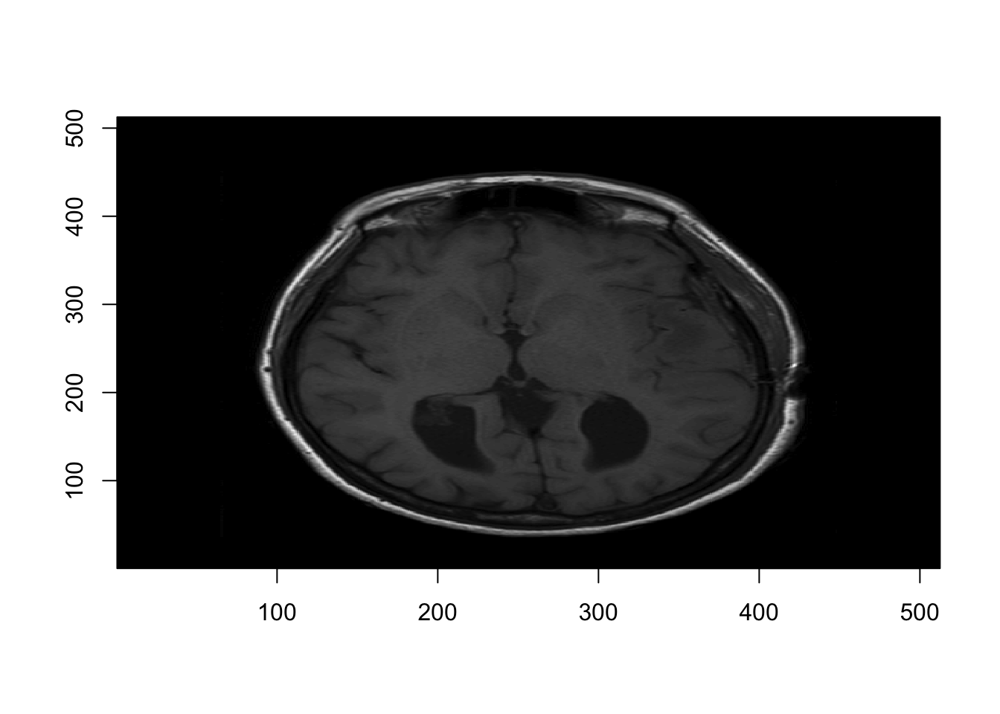
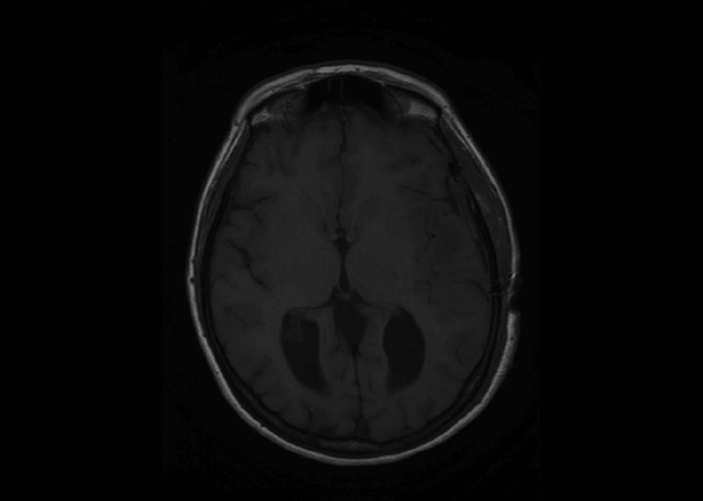
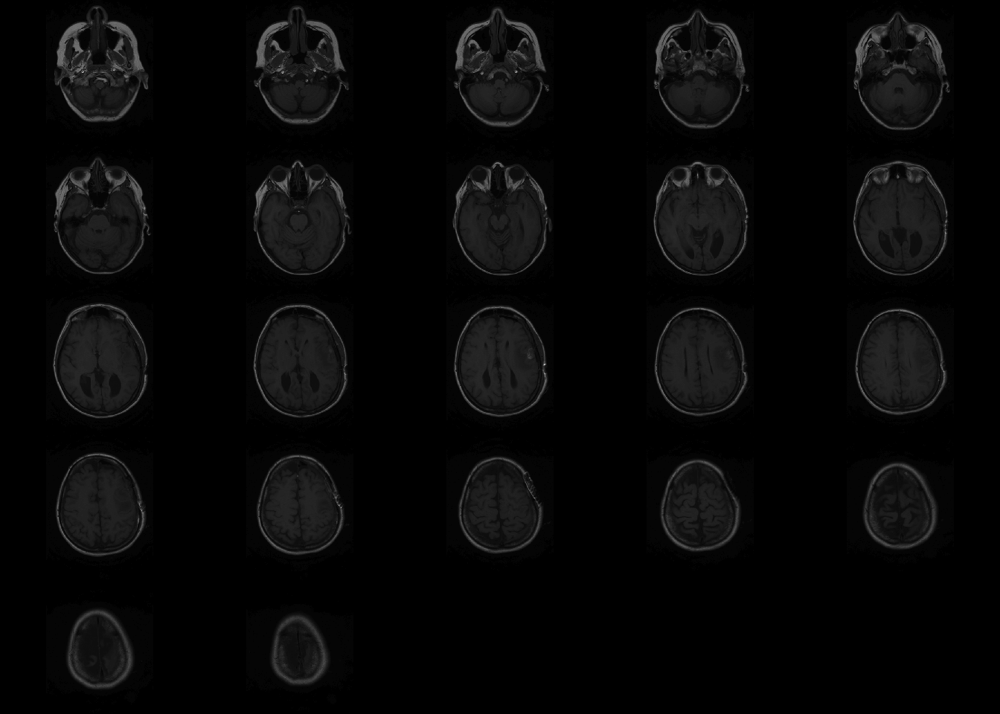
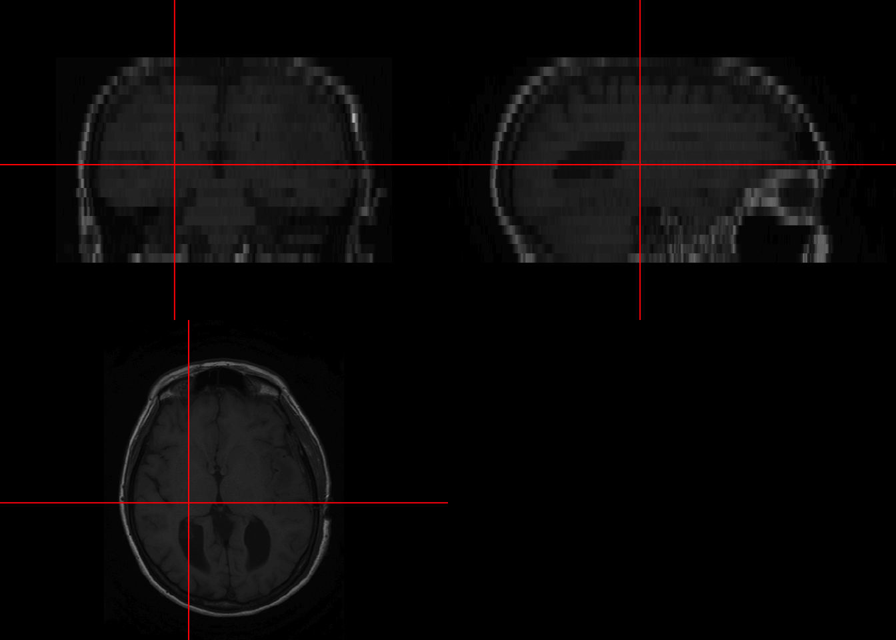
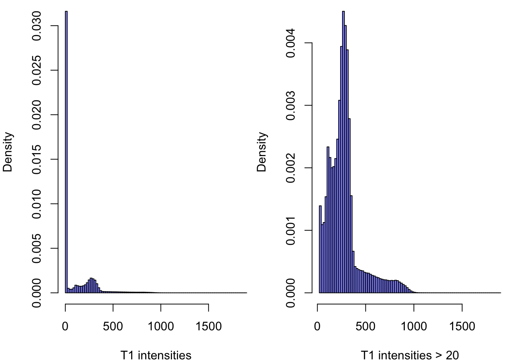
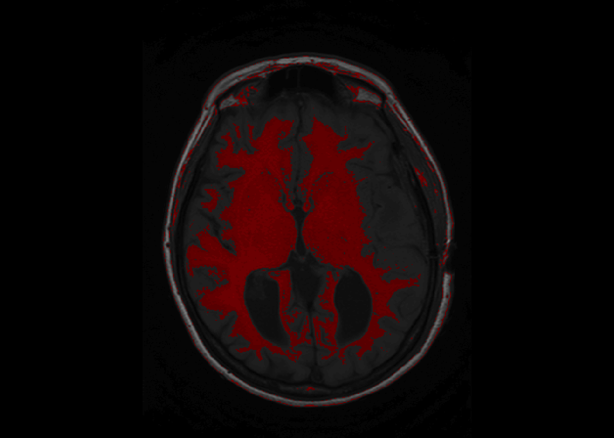
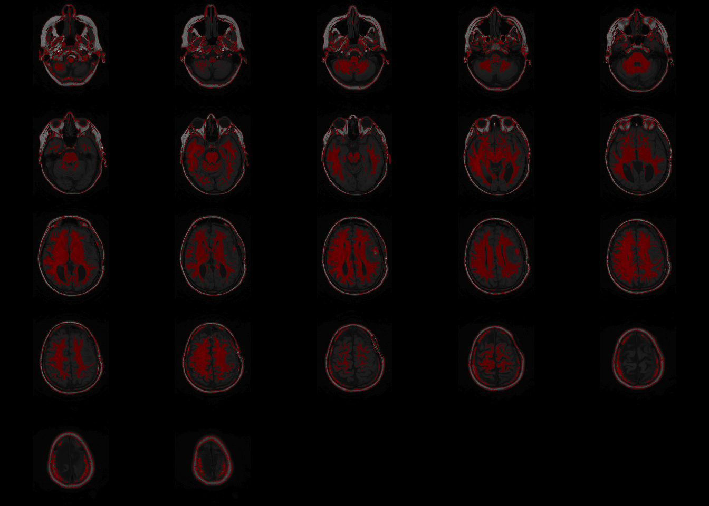
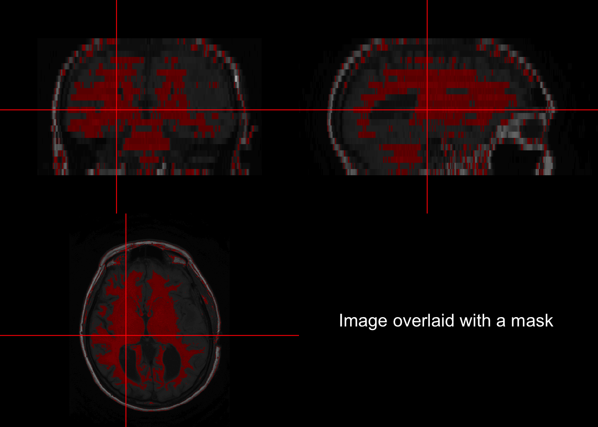

# Basic Visualization

This lecture goes over basic visualization methods. Objectives are the following:  
-Visualize Slices
-Digital Zoom
-Histograms of Intensities
-Back mapping

## Read NIfTI


```r
library(oro.nifti)
```

```
## oro.nifti 0.10.1
```

```r
dir = "Neurohacking_data/BRAINIX/NIfTI/"
fname = "Output_3D_File"
fpath = paste0(dir,fname)
(nii_T1 = readNIfTI(fname = fpath))
```

```
## NIfTI-1 format
##   Type            : nifti
##   Data Type       : 4 (INT16)
##   Bits per Pixel  : 16
##   Slice Code      : 0 (Unknown)
##   Intent Code     : 0 (None)
##   Qform Code      : 2 (Aligned_Anat)
##   Sform Code      : 2 (Aligned_Anat)
##   Dimension       : 512 x 512 x 22
##   Pixel Dimension : 0.47 x 0.47 x 5
##   Voxel Units     : mm
##   Time Units      : sec
```

Printing the NIfTI object show the structure of the data

## Visualizing Slices

As a first pass, we could use the image function from the graphics package.


```r
#Save dimensions of the image
d = dim(nii_T1)

# Visualizing the 11th axial slice
graphics::image(1:d[1], 1:d[2], nii_T1[,,11], 
      col = gray(0:64/64), xlab="", ylab="") 
```



However, `oro.nifti` has its own image function which is called by default one NIfTI objects.


```r
image(nii_T1, z = 11, plot.type = "single")
```



If no arguments are passed for coordinates, `oro.nifti::image` plots all the slices axially. 


```r
image(nii_T1)
```



The `orthographic` functions allows to visualize a single point from three dimensions. 


```r
orthographic(nii_T1, xyz = c(200,220,11))
```



## Exploratory histogram of intensities

Using R base graphics, we can get a quick view of the intensites in the brain.

```r
par(mfrow = c(1, 2));
o = par(mar = c(4,4,0,0))
hist(nii_T1, breaks = 75, prob = T, xlab="T1 intensities", col = rgb(0,0,1, 1/2), main="")

# Plot filtered by > 20
hist(nii_T1[nii_T1 > 20], breaks = 75, prob = T, xlab="T1 intensities > 20", col = rgb(0,0,1, 1/2), main="" )
```



A lot ot the voxels, are ~0 in the first plot since most of the image is the black background. The second plot shows the intensities that are higher than 20.

## Back mapping

Backmapping consists of overlaying a mask over an image of the brain. A basic backmapping can be achieved by taking creating a mask according to intensities and calling the function `overlay`.


```r
is_btw_300_400 = nii_T1 > 300 & nii_T1 < 400
nii_T1_mask = nii_T1
nii_T1_mask[!is_btw_300_400] = NA
overlay(nii_T1, nii_T1_mask, z = 11, plot.type="single")
```



`overlay` can be called to show a single slice as above, or the whole brain as below.


```r
overlay(nii_T1, nii_T1_mask)
```




```r
orthographic(nii_T1, nii_T1_mask, xyz=c(200,220,11), text="Image overlaid with a mask", text.cex = 1.5)
```

```
## Warning in min(x, na.rm = na.rm): no non-missing arguments to min; returning Inf
```

```
## Warning in max(x, na.rm = na.rm): no non-missing arguments to max; returning -
## Inf
```




 
