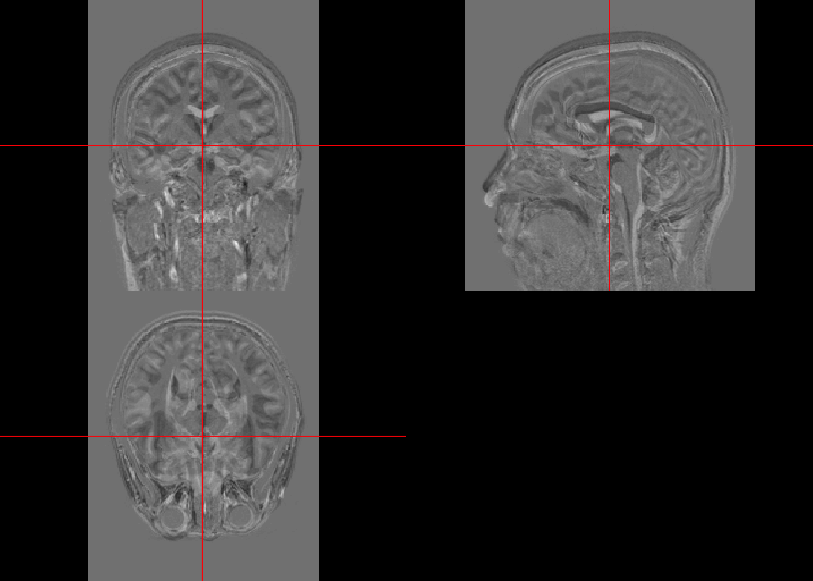

# Data Manipulation

This lecture covers:
- Masking
- Operations

## Open data

The code below downloads opens the T1-weighted image and downloads the mask for this data.

```r
fname = "113-01-MPRAGE.nii.gz"
fpath = file.path("Neurohacking_data/kirby21/visit_1/113", fname)

maskurl = "https://raw.githubusercontent.com/muschellij2/Neurohacking/master/Basic_Data_Manipulations/Kirby21/SUBJ0001_mask.nii.gz"
maskfname = "SUBJ0001_mask.nii.gz"
maskfpath = file.path("Neurohacking_data", maskfname)
download.file(maskurl, maskfpath, mode="wb")# NIfTI is binaryfile format

library(oro.nifti)
T1 = readNIfTI(fpath,reorient=FALSE)
mask = readNIfTI(maskfpath, reorient=FALSE) 
```

## Visualization

This brain was collected with a bigger FOV than the previous scans. Thus a lot of body parts other than brain are shown. 

```r
orthographic(T1)
```


```r
orthographic(mask)
```


## Masking


```r
masked.T1 = T1*mask
orthographic(masked.T1)
```


##  Substraction


```r
fname = "113-02-MPRAGE.nii.gz"
fpath = file.path("Neurohacking_data/kirby21/visit_2/113", fname)

T1.follow  = readNIfTI(fpath, reorient = FALSE)

substract.T1 = T1.follow - T1
min(substract.T1)
```

```
## [1] -1810405
```

```r
max(substract.T1)
```

```
## [1] 2054726
```


```r
orthographic(substract.T1)
```



