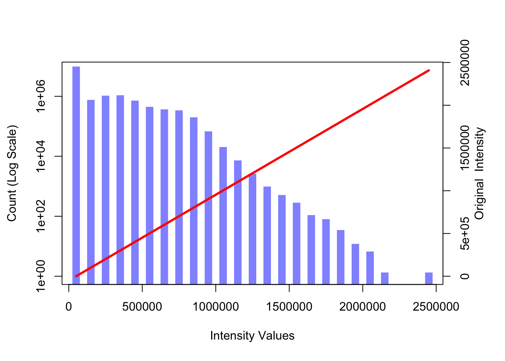
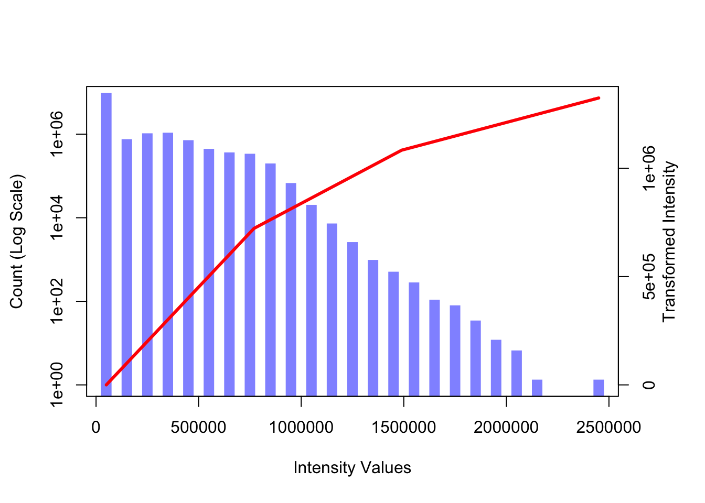
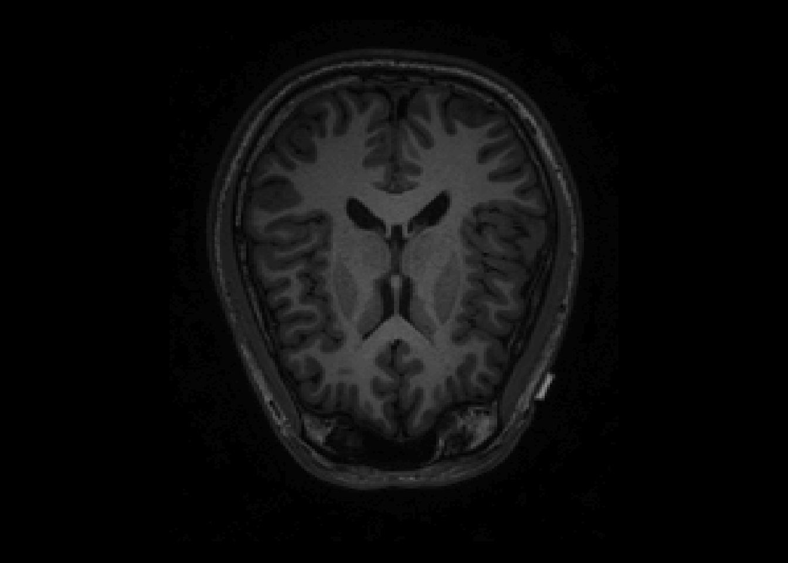
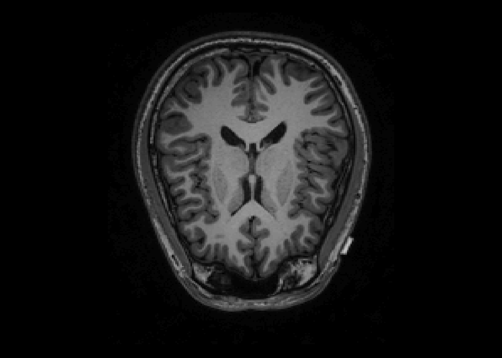
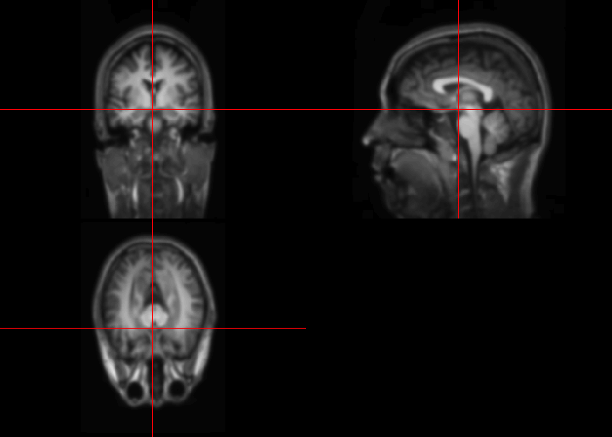

# Transformation

```r
fname = "SUBJ0001-01-MPRAGE.nii.gz"
fpath = file.path("Neurohacking_data/kirby21", fname)

library(oro.nifti)
```

```
## oro.nifti 0.10.1
```

```r
T1 = readNIfTI(fpath,reorient=FALSE)
```


```r
im_hist = hist(T1, plot=FALSE)
par(mar = c(5, 4, 4, 4) + 0.3)
col1 = rgb(0,0,1,1/2)
plot(im_hist$mids, im_hist$count, log="y", type="h",  lwd=10, lend=2, col=col1, xlab="Intensity Values", ylab="Count (Log Scale)")
```

```
## Warning in xy.coords(x, y, xlabel, ylabel, log): 2 y values <= 0 omitted from
## logarithmic plot
```

```r
par(new = TRUE)
curve(x*1, axes = FALSE, xlab="", ylab="", 
      col=2, lwd=3)
axis(side=4, at =pretty(range(im_hist$mids))/max(T1), labels=pretty(range(im_hist$mids)))
mtext("Original  Intensity", side=4, line=2)
```




```r
#Define a linear spline function
lin.sp = function(x, knots, slope){
    knots = c(min(x), knots, max(x))
    slopeS = slope[1]
    for(j in 2:length(slope)){
        slopeS = c(slopeS, slope[j]-sum(slopeS))
    }
    rvals = numeric(length(x))
    for(i in 2:length(knots)){
        rvals = ifelse(x >= knots[i-1], slopeS[i-1]*(x-knots[i-1])+rvals, rvals)
    }
    return(rvals)
}

#Define a linear spline
knot.vals = c(.3,.6)
slp.vals = c(1, .5, .25)

#Repeat the histgram
par(mar = c(5, 4, 4, 4) + 0.3)
plot(im_hist$mids, im_hist$count, log="y", type="h",  lwd=10, lend=2, col=col1, xlab="Intensity Values", ylab="Count (Log Scale)")
```

```
## Warning in xy.coords(x, y, xlabel, ylabel, log): 2 y values <= 0 omitted from
## logarithmic plot
```

```r
#Change curve() to graph linear pline
par(new = TRUE)
curve(lin.sp(x, knot.vals, slp.vals), axes=FALSE, xlab="", ylab="", col=2, lwd=3)
axis(side=4, at =pretty(range(im_hist$mids))/max(T1), labels=pretty(range(im_hist$mids)))
mtext("Transformed Intensity", side=4, line=2)
```




You can define different types of transfer functions. 

## Visualizing after transformations


```r
knot.vals = c(.3,.6)
slp.vals = c(1, .5, .25)

trans_T1 = lin.sp(T1, knot.vals*max(T1), slp.vals)
par(mfrow = c(1, 2))
image(T1, z=150, plot.type='single', main="Original Image")
```



```r
image(trans_T1, z=150, plot.type='single', main="Transformed  Image")
```



Notes
-Knots rescaled to the cale of intensities `knots.vals*max(T1)`
-The transfer function can be any functions
-Used for better:  
-visualization
-prediction
-input into standard software

## Smoothing


```r
library(AnalyzeFMRI)
```

```
## Loading required package: R.matlab
```

```
## R.matlab v3.6.2 (2018-09-26) successfully loaded. See ?R.matlab for help.
```

```
## 
## Attaching package: 'R.matlab'
```

```
## The following objects are masked from 'package:base':
## 
##     getOption, isOpen
```

```
## Loading required package: fastICA
```

```
## Loading required package: tcltk
```

```
## Loading required package: tkrplot
```

```r
smooth.T1 = GaussSmoothArray(T1, 
                             voxdim = c(1,1,1),
                             ksize=11,
                             sigma=diag(3,3),
                             mask = NULL,
                             var.norm = FALSE
                             )
orthographic(smooth.T1)
```




