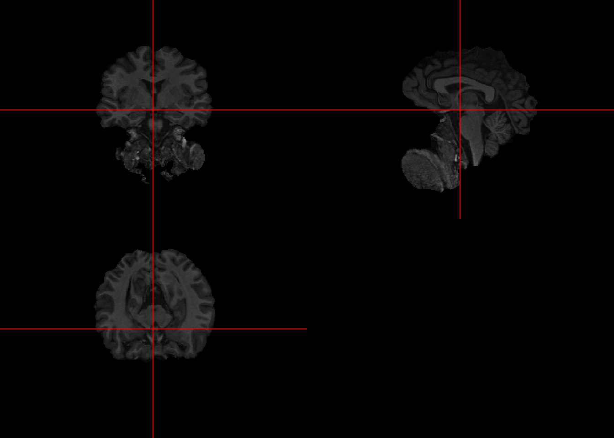

# Skull Stripping with FSL's Brain Extraction Tool (BET)


## Loading file


```r
#set fsl path before running fslr in RStudio
library(fslr)
if(!have.fsl()){
  options(fsl.path = '/usr/local/bin')
} 

#Check file paths for data downloaded from
library(oro.nifti)
fpath = "Neurohacking_data/kirby21/visit_1/113"
fname = "fast-113-01-MPRAGE"
fast_img = readNIfTI(file.path(fpath,fname), reorient=FALSE)
```

## Running BET


```r
bet_fast = fslr::fslbet(infile=fast_img, retimg = TRUE)
```

```
## FSLDIR='/usr/local/fsl'; PATH=${FSLDIR}/bin:${PATH};export PATH FSLDIR; sh "${FSLDIR}/etc/fslconf/fsl.sh"; FSLOUTPUTTYPE=NIFTI_GZ; export FSLOUTPUTTYPE; ${FSLDIR}/bin/bet2 "/private/var/folders/wk/jzm8xd01507b9nx7qmycj7700000gn/T/RtmpmusoTp/file2c314bb9976d.nii.gz" "/var/folders/wk/jzm8xd01507b9nx7qmycj7700000gn/T//RtmpmusoTp/file2c311d9f6564"
```

## Visualizing first past

To visualize the effects of the brain extraction on the original, the `orthographic` may be used twice by passing (1) the image returned by BET, (2) the original image overlaid by a mask. To produce the mask, follow the code below. 

```r
# create an array of 1s with same dimensions as the skull-stripped image
bet_fast_mask = niftiarr(bet_fast, 1)

# set all non-brain voxel to NA
bet_fast_mask[!(bet_fast > 0)] <- NA

# plot
orthographic(bet_fast)
```


```r
orthographic(fast_img, bet_fast_mask)
```


The results are not great since a lot of non-brain areas get included.

## Improving Brain Extraction

To improve upon the results, a second pass can be done taking into account the center of gravity. 


```r
# use the cog function on the skull-stripped image
cog = cog(bet_fast, ceil = TRUE)

#prepare a string to be passed to opts parameter of fslbet
cog = paste("-c", paste(cog, collapse = " "))

# run BET on the bias-corrected img using the center of gravity to get cleaner results
bet_fast2 = fslbet(infile = fast_img, retimg = TRUE, opts = cog)
```

```
## FSLDIR='/usr/local/fsl'; PATH=${FSLDIR}/bin:${PATH};export PATH FSLDIR; sh "${FSLDIR}/etc/fslconf/fsl.sh"; FSLOUTPUTTYPE=NIFTI_GZ; export FSLOUTPUTTYPE; ${FSLDIR}/bin/bet2 "/private/var/folders/wk/jzm8xd01507b9nx7qmycj7700000gn/T/RtmpmusoTp/file2c314582822.nii.gz" "/var/folders/wk/jzm8xd01507b9nx7qmycj7700000gn/T//RtmpmusoTp/file2c313a31728f" -c 88 140 129
```

## Visualizing first and second pass

```r
orthographic(bet_fast)
```



```r
orthographic(bet_fast2)
```


The results have improved, removing much of the lower non-brain sections. However, we can see the results are not perfect so it's important to visually inspect each image at each phase of the processing pipeline.

## Write NIfTI

```r
fname = paste0("bet2-",fname)
suppressMessages(oro.nifti::writeNIfTI(bet_fast2, file.path(fpath, fname)))
```
