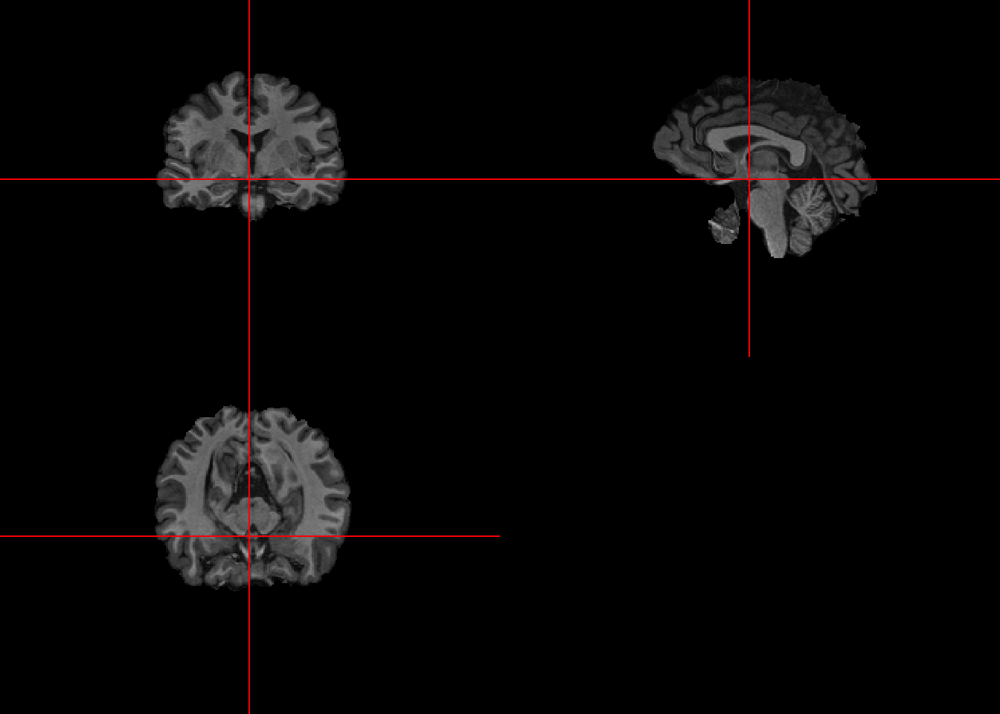
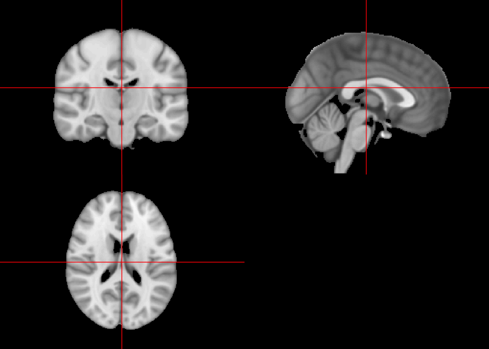
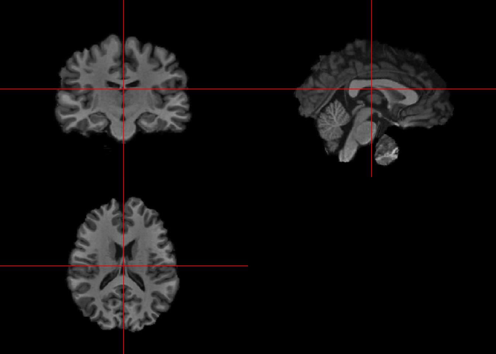

# Registration to a template (Spatial Normalization)

## Linear Registration

FSL's FMRIB's Linear Image Registration Tool (FLIRT) implements rigid and affine transformation to the the image

### Read files

```r
library(oro.nifti)
```

```
## oro.nifti 0.10.1
```

```r
temp_dir = "Neurohacking_data/Template"
template_img = oro.nifti::readNIfTI(file.path(temp_dir, "MNI152_T1_1mm_brain.nii.gz"), reorient = FALSE)

fpath = "Neurohacking_data/kirby21/visit_1/113"
fname = "bet2-fast-113-01-MPRAGE"
bet2_fast_img = oro.nifti::readNIfTI(file.path(fpath, fname), reorient = FALSE)
orthographic(bet2_fast_img)
```




### Running FLIRT for rigid transformation


```r
register_img = fslr::flirt(infile = bet2_fast_img, 
                     reffile = template_img, 
                     dof = 6, #for rigid transformation
                     retimg = TRUE)
```

```
## Warning in get.fsl(): Setting fsl.path to /usr/local/fsl
```

```
## Warning in get.fsloutput(): Can't find FSLOUTPUTTYPE, setting to NIFTI_GZ
```

```
## FSLDIR='/usr/local/fsl'; PATH=${FSLDIR}/bin:${PATH};export PATH FSLDIR; sh "${FSLDIR}/etc/fslconf/fsl.sh"; FSLOUTPUTTYPE=NIFTI_GZ; export FSLOUTPUTTYPE; ${FSLDIR}/bin/flirt -in "/private/var/folders/wk/jzm8xd01507b9nx7qmycj7700000gn/T/RtmpBiaW4A/file2dfa598620f5.nii.gz" -ref "/private/var/folders/wk/jzm8xd01507b9nx7qmycj7700000gn/T/RtmpBiaW4A/file2dfa74dde2bd.nii.gz" -out "/var/folders/wk/jzm8xd01507b9nx7qmycj7700000gn/T//RtmpBiaW4A/file2dfa4f283844" -dof 6 -omat "/var/folders/wk/jzm8xd01507b9nx7qmycj7700000gn/T//RtmpBiaW4A/file2dfa1351223c.mat"
```

```r
orthographic(template_img)
```



```r
orthographic(register_img)
```




